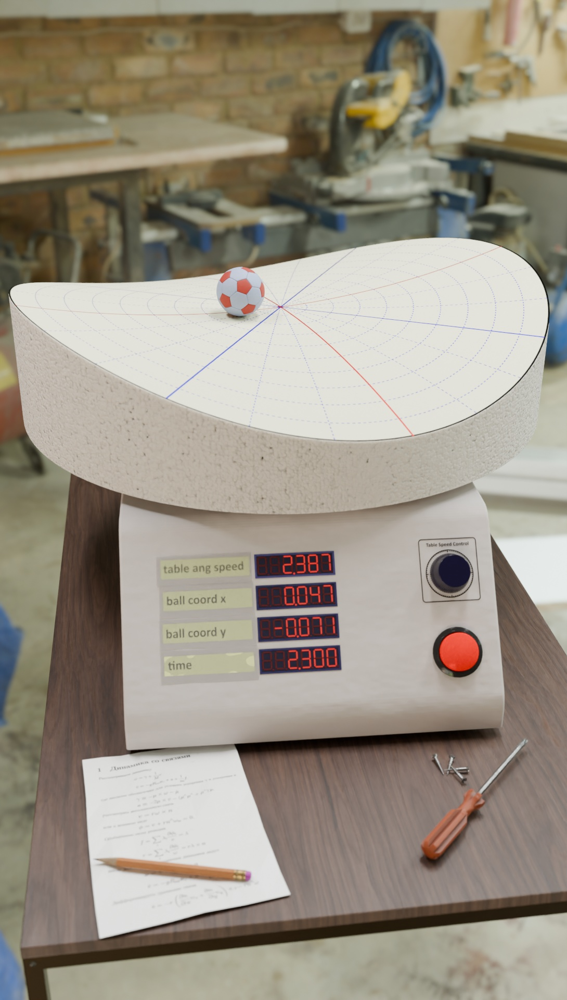

# Ball Rolling Simulation
The program simulates a ball which is rolling over a curved surface

The project includes
* math equations describing dynamics of the system
* python script for computing system trajectory
* blender model
